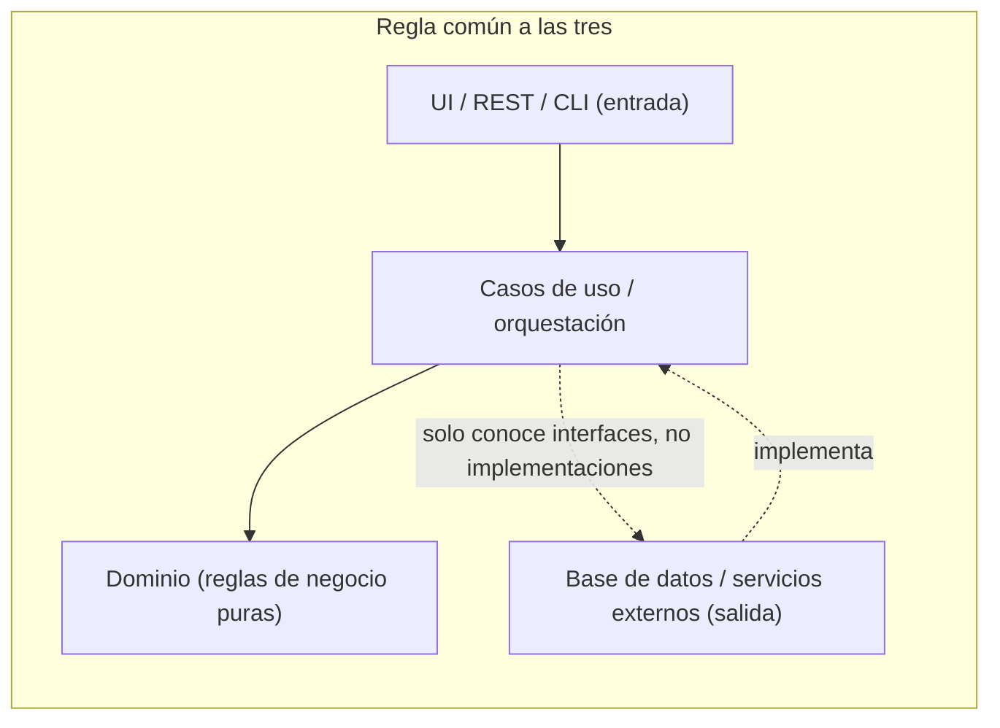
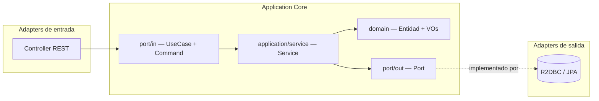
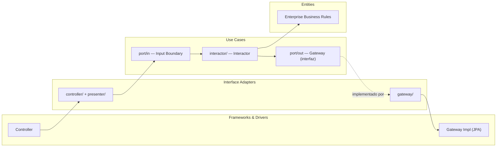
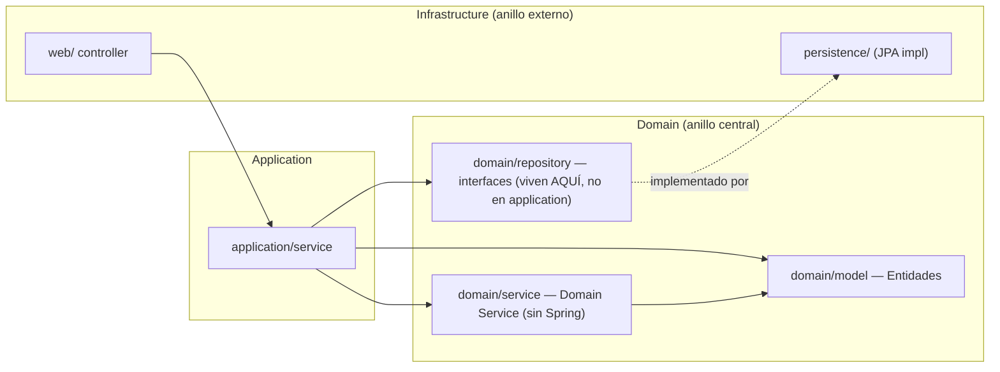

# Hexagonal vs Clean vs Onion — comparación

Notas consolidadas a partir de los tres proyectos del playground:
[`01-hexagonal-architecture`](../../01-hexagonal-architecture/spring-webflux-hexagonal-architecture),
[`02-onion-architecture`](../../02-onion-architecture/spring-boot-onion-architecture) y
[`03-clean-architecture`](../../03-clean-architecture/spring-boot-clean-architecture).
El detalle y la justificación de cada decisión vive en el `CLAUDE.md` de cada
proyecto — esto es el resumen que permite comparar los tres de un vistazo.

## La idea común a las tres

Las tres son variantes de la misma idea central: **el dominio/negocio no
depende de la infraestructura; la infraestructura depende del dominio**
(Dependency Inversion). Difieren en cómo dibujan las capas, cómo llaman a
cada pieza, y cuánto formalismo exigen.

## Diagrama — Hexagonal (Ports & Adapters)

## Diagrama — Clean Architecture (círculos concéntricos)

## Diagrama — Onion Architecture (anillos)

**Diferencia clave de Onion:** las interfaces de persistencia
(`domain/repository`) viven **dentro del dominio**, no en la capa de
aplicación como en Hexagonal (`port/out`) o Clean (`usecases/port/out`). Y la
lógica de negocio que cruza más de un agregado tiene su propia capa explícita
(`domain/service`), sin anotaciones de framework.

## Tabla comparativa de terminología

| Concepto | Hexagonal | Clean Architecture | Onion |
|---|---|---|---|
| Interfaz que expone un caso de uso | `port/in`, sufijo `UseCase` | `usecases/port/in` ("Input Boundary") | No hay interfaz por operación — el Application Service es una clase concreta |
| Implementación del caso de uso | `application/service`, sufijo `Service` | `usecases/interactor`, sufijo `Interactor` | `application/service`, sufijo `Service` |
| Interfaz hacia infraestructura (persistencia) | `application/port/out`, sufijo `Port` | `usecases/port/out`, sufijo `Gateway` | `domain/repository` (vive en el dominio) |
| Adaptador que implementa esa interfaz | `infrastructure/adapter/out/persistence`, sufijo `Adapter` | `interfaceadapters/gateway`, sufijo `Impl` | `infrastructure/persistence`, sufijo `Impl` |
| Adaptador de entrada HTTP | `infrastructure/adapter/in/web` | `interfaceadapters/controller` | `infrastructure/web` |
| Lógica que cruza 2+ agregados | En el `Service` de aplicación | En el `Interactor` | `domain/service` — capa de dominio explícita, sin framework |
| ¿Exige interfaz por caso de uso? | Sí | Sí | No |
| Autor / origen | Alistair Cockburn (2005) | Robert C. Martin (2012/2017) | Jeffrey Palermo (2008) |

## Tabla comparativa de decisiones técnicas (en este playground)

| | 01 Hexagonal | 02 Onion | 03 Clean |
|---|---|---|---|
| Web stack | Spring **WebFlux** (reactivo) | Spring **MVC** + Virtual Threads | Spring **MVC** + Virtual Threads |
| Persistencia | **R2DBC** + H2 | **JPA**/Hibernate + H2 | **JPA**/Hibernate + H2 |
| Tipo de retorno en puertos | `Mono<T>` / `Flux<T>` (obligatorio) | `Optional<T>` / tipos directos | `Optional<T>` / tipos directos |
| Entidad de persistencia | `record` (sin sesión/dirty-checking en R2DBC) | Clase mutable (JPA necesita dirty-checking) | Clase mutable (mismo motivo) |
| Patrón Presenter/ViewModel completo | No | No | Sí, una vez (`GetAccountBalance`), para mostrar el patrón completo de Uncle Bob |
| Dominio en dos ramas A/B | Sí (`salud` vs `coffee-shop`) | No | No |

## ¿Cuándo usar cada una?

- **Hexagonal (Ports & Adapters):** cuando el objetivo explícito es la
  **sustituibilidad de adaptadores** (ej. swapear la base de datos, exponer
  el mismo caso de uso por REST y por mensajería, testear sin infraestructura
  real). Es la más liviana de las tres formalmente — no exige una jerarquía
  de círculos, solo la separación *in/out*. Buen default cuando el equipo ya
  conoce el patrón y el negocio es de complejidad media.
- **Clean Architecture:** cuando el negocio es lo bastante complejo como para
  necesitar **una regla de dependencia explícita entre varias capas nombradas**
  (Entities → Use Cases → Interface Adapters → Frameworks), y se quiere dejar
  documentado *por qué* cada pieza está en su círculo — es la más
  "enseñable"/formal de las tres, a costa de más ceremonia (Interactors,
  Boundaries, Presenters). Encaja bien en proyectos grandes, de larga vida, o
  como referencia pedagógica.
- **Onion Architecture:** cuando además de aislar infraestructura, se quiere
  remarcar que el **dominio puede tener servicios propios** (no solo
  entidades) y que las interfaces de persistencia son, conceptualmente, parte
  del dominio (qué necesita el negocio) y no de la aplicación. Útil cuando
  hay reglas de negocio que cruzan varios agregados y se quiere una capa
  explícita para ellas, separada tanto del dominio "pasivo" como de la
  orquestación de aplicación.

En la práctica, las tres resuelven el mismo problema (aislar el negocio de
frameworks/infraestructura) con distinto vocabulario y distinto nivel de
formalismo — la elección real en un equipo suele depender de con qué
convención ya está familiarizado, más que de una superioridad técnica de una
sobre otra.

## Referencias

Cada proyecto lista sus propias referencias en su README; consolidado:

- Alistair Cockburn — [*Hexagonal Architecture*](https://alistair.cockburn.us/hexagonal-architecture/).
- Tom Hombergs — [*Get Your Hands Dirty on Clean Architecture*](https://reflectoring.io/book/) y [`buckpal`](https://github.com/thombergs/buckpal).
- Jeffrey Palermo — [*The Onion Architecture*](https://jeffreypalermo.com/2008/07/the-onion-architecture-part-1/) (2008).
- Robert C. Martin — *Clean Architecture* (2017).
- Vaughn Vernon — *Implementing Domain-Driven Design* (IDDD).
- Eric Evans — *Domain-Driven Design*.
- Arho Huttunen — [arhohuttunen.com/hexagonal-architecture-spring-boot](https://www.arhohuttunen.com/hexagonal-architecture-spring-boot/).
- Documentación oficial de Spring Framework/Spring Boot y Project Reactor.
