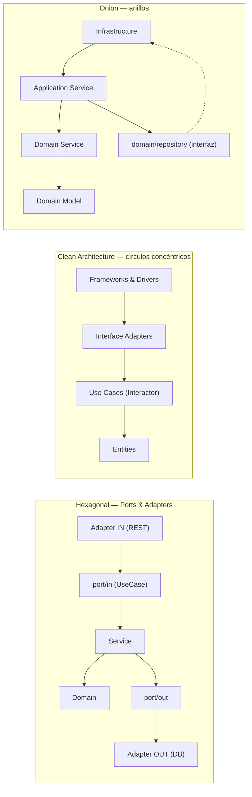

# Píldora de estudio — Hexagonal vs Clean vs Onion (para entrevistas técnicas)

Resumen corto pensado para repasar antes de una entrevista de **arquitecto de
software / solutions architect / tech lead**: un diagrama único de las tres,
estructura de carpetas, ventajas/desventajas y cómo defender la elección. Para
el detalle profundo (terminología completa, diagramas por separado, tablas
técnicas) ver
[`comparacion-arquitecturas.md`](comparacion-arquitecturas.md).

## El diagrama de un vistazo



**La regla que comparten las tres:** el negocio no importa el framework, el
framework importa el negocio (Dependency Inversion). Lo que cambia es
**cuántas capas nombran explícitamente** y **dónde viven las interfaces de
persistencia**.

## Estructura de carpetas — lado a lado

```
HEXAGONAL                      CLEAN ARCHITECTURE             ONION
├── domain/                    ├── entities/                  ├── domain/
│   └── Appointment.java       │   └── Account.java           │   ├── model/Product.java
├── application/                                               │   ├── service/  (Domain Service)
│   ├── port/in/               ├── usecases/                  │   └── repository/ (interfaz)
│   │   └── XxxUseCase.java    │   ├── port/in/  (Input Bnd.)
│   ├── port/out/              │   ├── port/out/ (Gateway)    ├── application/
│   │   └── XxxPort.java       │   └── interactor/            │   └── service/
│   └── service/                                                │       └── XxxService.java
│       └── XxxService.java    ├── interfaceadapters/
                                │   ├── controller/            ├── infrastructure/
├── infrastructure/             │   ├── presenter/              │   ├── web/
│   └── adapter/                │   └── gateway/  (impl)        │   └── persistence/ (impl)
│       ├── in/web/
│       └── out/persistence/    └── frameworksdrivers/
                                    ├── controller/ (Spring)
                                    └── persistence/ (JPA)
```

**Detalle que suele preguntarse en entrevista:** en Onion, la interfaz del
repositorio vive **dentro de `domain/`**, no en la capa de aplicación —
porque conceptualmente es el dominio quien "pide" persistencia, no la
aplicación. En Hexagonal y Clean esa interfaz vive junto al caso de uso
(`port/out` / `usecases/port/out`), fuera del dominio puro.

## Ventajas y desventajas

| | Ventajas | Desventajas |
|---|---|---|
| **Hexagonal** | Formalismo mínimo — solo *in/out*. Fácil de explicar en una pizarra. Ideal cuando hay **varios adaptadores de entrada/salida intercambiables** (REST + mensajería + gRPC; SQL hoy, NoSQL mañana). Buen equilibrio esfuerzo/beneficio para equipos medianos. | Al no prescribir capas internas, dos equipos "hexagonales" pueden organizarse distinto — más disciplina implícita requerida. No fuerza separar reglas que cruzan agregados. |
| **Clean Architecture** | Regla de dependencia explícita y **enseñable** capa por capa (Entities → Use Cases → Interface Adapters → Frameworks). Presenter/ViewModel deja el modelo de salida desacoplado de la UI. Excelente para onboarding y para justificar decisiones ante auditoría/arquitectura. | Más ceremonia: Interactor + Input Boundary + Output Boundary + Presenter por caso de uso. Puede sentirse sobre-ingenierizado en un CRUD simple o un microservicio pequeño. |
| **Onion** | Deja explícito que el **dominio puede tener servicios propios** (no solo entidades pasivas) y que las interfaces de persistencia son parte del contrato del dominio. Bueno cuando hay reglas que cruzan varios agregados. | Menos estandarizado en la industria que Hexagonal/Clean — hay más variación de una implementación a otra. Puede confundirse con Hexagonal si no se es explícito con dónde vive `repository/`. |

## Cómo elegir (y cómo defenderlo en entrevista)

1. **¿El dolor real es cambiar de infraestructura o soportar múltiples
   entradas/salidas?** → Hexagonal. Ejemplo: hoy Postgres, mañana quizás
   DynamoDB; hoy REST, mañana también un consumer de Kafka para el mismo
   caso de uso.
2. **¿El dolor real es la complejidad de negocio y necesitas que el equipo
   entienda "qué puede depender de qué" sin ambigüedad, con muchas
   iteraciones/años de vida por delante?** → Clean Architecture. Ejemplo:
   sistema bancario/core con muchas reglas y auditoría de decisiones de
   diseño.
3. **¿El dolor real es que la lógica de negocio cruza varios agregados y
   quieres que eso tenga un lugar explícito, además de dejar claro que la
   persistencia es "propiedad" del dominio?** → Onion. Ejemplo: inventario
   donde una regla de negocio (ej. reservar stock) involucra `Product` +
   `StockItem` a la vez.
4. **No todo necesita la arquitectura completa.** Un caso de uso aislado, un
   script, un endpoint utilitario o un servicio de vida corta puede no
   justificar ninguna de las tres formalmente — aplicar el mismo principio
   (dominio no depende de infraestructura) sin la ceremonia completa suele
   ser la respuesta correcta, y decirlo así en una entrevista demuestra
   criterio, no dogma.
5. **Frase resumen para entrevista:** "Las tres imponen la misma regla de
   dependencia; elijo la que menos ceremonia agrega para el problema que
   tengo enfrente — Hexagonal si el eje es sustituir adaptadores, Clean si el
   eje es la complejidad de negocio a largo plazo y necesito una capa
   pedagógica explícita, Onion si el eje es dejar el dominio como dueño de
   sus propios servicios y contratos de persistencia."

## Ver también

- [`comparacion-arquitecturas.md`](comparacion-arquitecturas.md) — comparación
  completa: diagramas por separado, tabla de terminología, tabla de
  decisiones técnicas tomadas en este playground.
- El `CLAUDE.md` de cada proyecto (`01-hexagonal-architecture`,
  `02-onion-architecture`, `03-clean-architecture`) — el razonamiento
  detallado detrás de cada decisión concreta.
